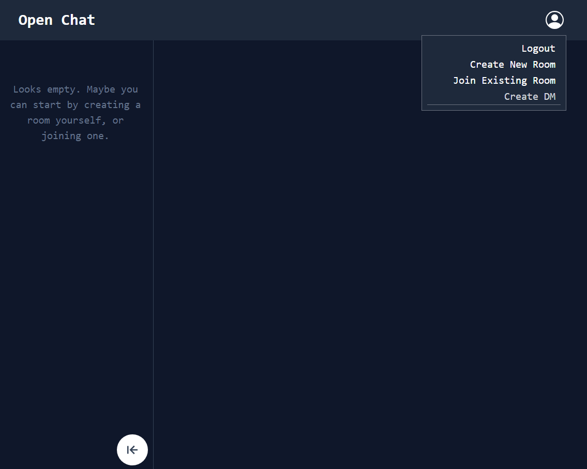
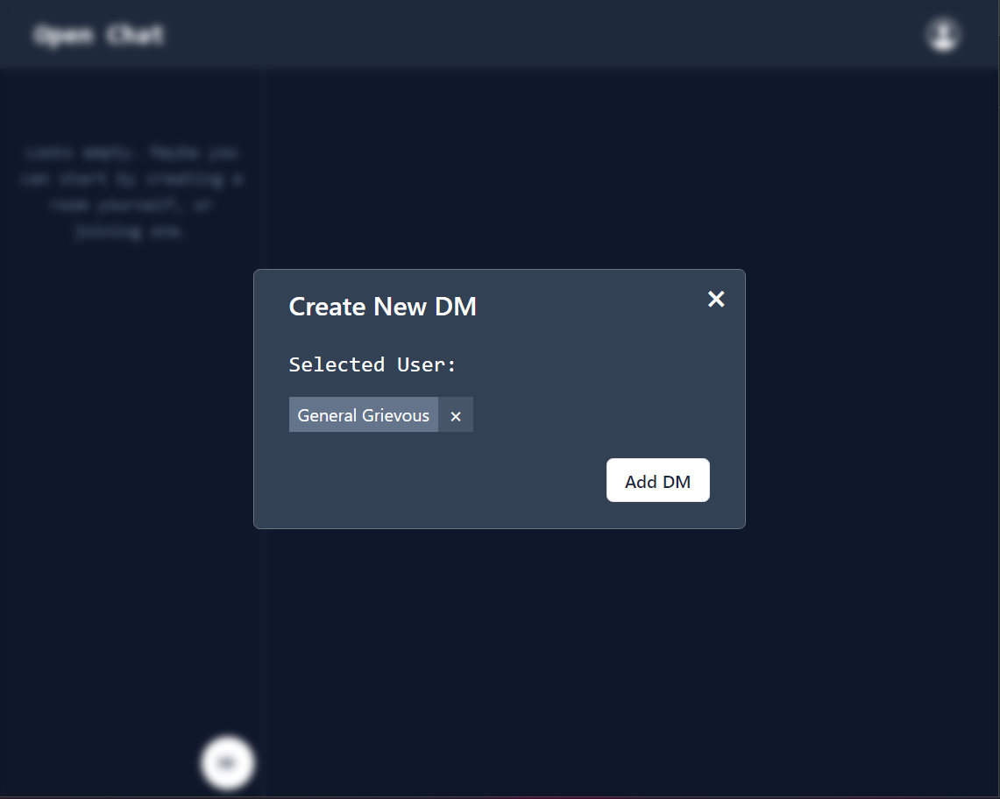
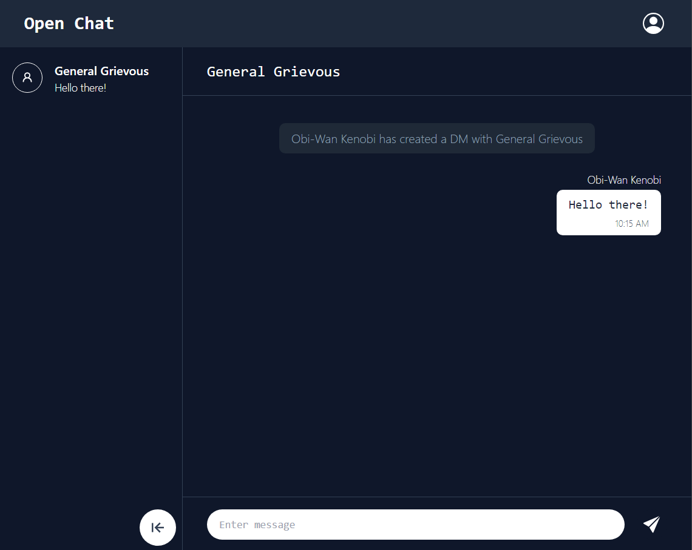
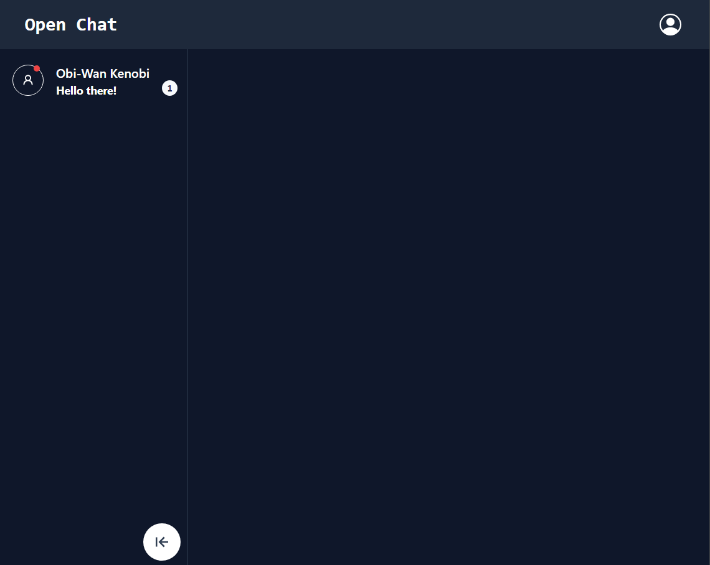
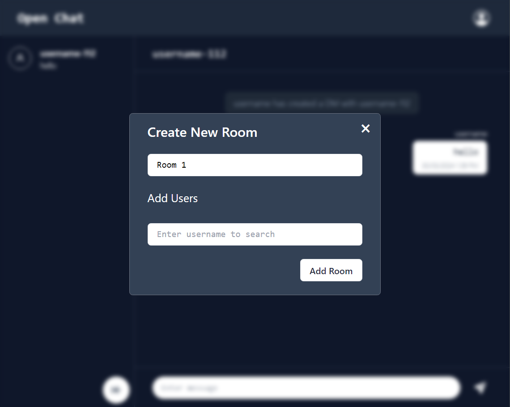
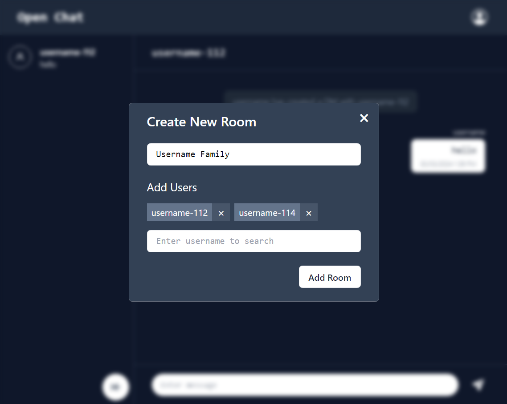
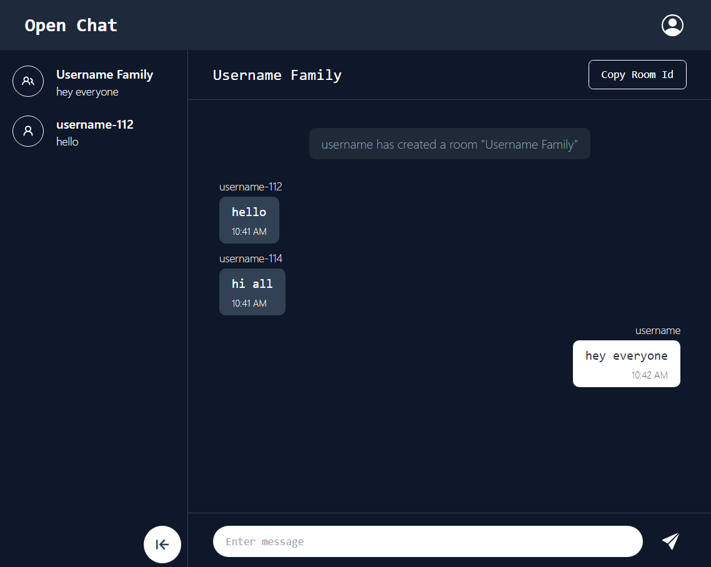

# Open Chat - chat application with SocketIO

**Important**: Deployment to be done soon!

## Built with:
#### Frontend: 
    
#### Backend: 
   

 ## Screenshots
 ### 1. Create new DM flow:
  
  

 ### 2. Create new room flow
  
 